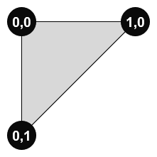

These models are intended to test the effects of flagging specular glossiness as `ExtensionUsed`, but not applying it to a mesh.  
The model is made up of two triangle meshes positioned next to each other.

Primitive 0 Vertex UV Mapping | Primitive 1 Vertex UV Mapping
:---: | :---:
 |  

The following table shows the properties that are set for every model. The metallic roughness base color texture acts as a fallback when the specular glossiness extension is not supported in the renderer.  

| Property | **Values** |
| :---: | :---: |
| Extension Used | Specular Glossiness |
| Base Color Texture |  |

 
The following table shows the properties that are set for a given model.  

|   | Sample Image | Specular Glossiness On Material 0 | Specular Glossiness On Material 1 |
| :---: | :---: | :---: | :---: |
| [00](Material_Mixed_00.gltf) [View](https://bghgary.github.io/glTF-Assets-Viewer/?type=Positive&folder=11&model=0) |  | :white_check_mark: | :white_check_mark: |
| [01](Material_Mixed_01.gltf) [View](https://bghgary.github.io/glTF-Assets-Viewer/?type=Positive&folder=11&model=1) |  | :x: | :x: |
| [02](Material_Mixed_02.gltf) [View](https://bghgary.github.io/glTF-Assets-Viewer/?type=Positive&folder=11&model=2) |  | :white_check_mark: | :x: |
 
