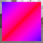
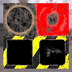

These models are intended to test the various properties of specular glossiness.  

The following table shows the properties that are set for every model.  

The metallic roughness base color texture will not be visible unless there is an error in the renderer.  

| Property | **Values** |
| :---: | :---: |
| Extension Used | Specular Glossiness |
| Extension Required | Specular Glossiness |
| Base Color Texture |  |

 
The following table shows the properties that are set for a given model.  

|   | Sample Image | Vertex Color | Diffuse Texture | Diffuse Factor | Specular Glossiness Texture | Specular Factor | Glossiness Factor |
| :---: | :---: | :---: | :---: | :---: | :---: | :---: | :---: |
| [00](Material_SpecularGlossiness_00.gltf) [View](https://bghgary.github.io/glTF-Assets-Viewer/?type=Positive&folder=12&model=0) |  |   |   |   |   |   |   |
| [01](Material_SpecularGlossiness_01.gltf) [View](https://bghgary.github.io/glTF-Assets-Viewer/?type=Positive&folder=12&model=1) |  | Vector3 Float |   |   |   | [0.0,&nbsp;0.0,&nbsp;0.0] |   |
| [02](Material_SpecularGlossiness_02.gltf) [View](https://bghgary.github.io/glTF-Assets-Viewer/?type=Positive&folder=12&model=2) |  |   |  |   |   | [0.0,&nbsp;0.0,&nbsp;0.0] |   |
| [03](Material_SpecularGlossiness_03.gltf) [View](https://bghgary.github.io/glTF-Assets-Viewer/?type=Positive&folder=12&model=3) |  |   |   | [0.2,&nbsp;0.2,&nbsp;0.2,&nbsp;0.8] |   | [0.0,&nbsp;0.0,&nbsp;0.0] |   |
| [04](Material_SpecularGlossiness_04.gltf) [View](https://bghgary.github.io/glTF-Assets-Viewer/?type=Positive&folder=12&model=4) |  |   |   |   |  |   |   |
| [05](Material_SpecularGlossiness_05.gltf) [View](https://bghgary.github.io/glTF-Assets-Viewer/?type=Positive&folder=12&model=5) |  |   |   |   |   | [0.4,&nbsp;0.4,&nbsp;0.4] |   |
| [06](Material_SpecularGlossiness_06.gltf) [View](https://bghgary.github.io/glTF-Assets-Viewer/?type=Positive&folder=12&model=6) |  |   |   |   |   |   | 0.3 |
| [07](Material_SpecularGlossiness_07.gltf) [View](https://bghgary.github.io/glTF-Assets-Viewer/?type=Positive&folder=12&model=7) |  | Vector3 Float |  |   |   | [0.0,&nbsp;0.0,&nbsp;0.0] |   |
| [08](Material_SpecularGlossiness_08.gltf) [View](https://bghgary.github.io/glTF-Assets-Viewer/?type=Positive&folder=12&model=8) |  |   |  | [0.2,&nbsp;0.2,&nbsp;0.2,&nbsp;0.8] |   | [0.0,&nbsp;0.0,&nbsp;0.0] |   |
| [09](Material_SpecularGlossiness_09.gltf) [View](https://bghgary.github.io/glTF-Assets-Viewer/?type=Positive&folder=12&model=9) |  |   |  |   |   |   | 0.3 |
| [10](Material_SpecularGlossiness_10.gltf) [View](https://bghgary.github.io/glTF-Assets-Viewer/?type=Positive&folder=12&model=10) |  |   |   |   |  | [0.4,&nbsp;0.4,&nbsp;0.4] |   |
| [11](Material_SpecularGlossiness_11.gltf) [View](https://bghgary.github.io/glTF-Assets-Viewer/?type=Positive&folder=12&model=11) |  |   |   |   |  |   | 0.3 |
| [12](Material_SpecularGlossiness_12.gltf) [View](https://bghgary.github.io/glTF-Assets-Viewer/?type=Positive&folder=12&model=12) |  |   |  |   |   | [0.4,&nbsp;0.4,&nbsp;0.4] | 0.3 |
| [13](Material_SpecularGlossiness_13.gltf) [View](https://bghgary.github.io/glTF-Assets-Viewer/?type=Positive&folder=12&model=13) |  | Vector3 Float |  | [0.2,&nbsp;0.2,&nbsp;0.2,&nbsp;0.8] |  | [0.4,&nbsp;0.4,&nbsp;0.4] | 0.3 |
 
