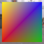
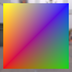

These models are intended to test applying vertex colors with different component types to a primitive.  

The following table shows the properties that are set for a given model.  

|   | Sample Image | Vertex Color |
| :---: | :---: | :---: |
| [00](Mesh_PrimitiveVertexColor_00.gltf) [View](https://bghgary.github.io/glTF-Assets-Viewer/?type=Positive&folder=16&model=0) |  | Vector3 Float |
| [01](Mesh_PrimitiveVertexColor_01.gltf) [View](https://bghgary.github.io/glTF-Assets-Viewer/?type=Positive&folder=16&model=1) |  | Vector3 Normalized Unsigned Byte |
| [02](Mesh_PrimitiveVertexColor_02.gltf) [View](https://bghgary.github.io/glTF-Assets-Viewer/?type=Positive&folder=16&model=2) |  | Vector3 Normalized Unsigned Short |
| [03](Mesh_PrimitiveVertexColor_03.gltf) [View](https://bghgary.github.io/glTF-Assets-Viewer/?type=Positive&folder=16&model=3) |  | Vector4 Float |
| [04](Mesh_PrimitiveVertexColor_04.gltf) [View](https://bghgary.github.io/glTF-Assets-Viewer/?type=Positive&folder=16&model=4) |  | Vector4 Normalized Unsigned Byte |
| [05](Mesh_PrimitiveVertexColor_05.gltf) [View](https://bghgary.github.io/glTF-Assets-Viewer/?type=Positive&folder=16&model=5) |  | Vector4 Normalized Unsigned Short |
 
