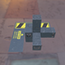
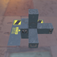

These models are intended to test the basic attributes of the node object.  

The following table shows the properties that are set for every model.  

| Property | **Values** |
| :---: | :---: |
| Normal Texture |  |
| Base Color Texture |  |
| Metallic Roughness Texture |  |

 

Every model has three nodes. Node 0 is usable as a point of reference. Node 1 is a child of node 0 and is where transforms are applied.  
Node 2 is a child of node 1 and will receive the same transformations by inheritance.  

The following table shows the properties that are set for a given model.  

|   | Sample Image | Matrix | Translation | Rotation | Scale |
| :---: | :---: | :---: | :---: | :---: | :---: |
| [00](Node_Attribute_00.gltf) [View](https://bghgary.github.io/glTF-Assets-Viewer/?type=Positive&folder=19&model=0) |  |   |   |   |   |
| [01](Node_Attribute_01.gltf) [View](https://bghgary.github.io/glTF-Assets-Viewer/?type=Positive&folder=19&model=1) |  |   | [-2.0,&nbsp;2.0,&nbsp;-2.0] |   |   |
| [02](Node_Attribute_02.gltf) [View](https://bghgary.github.io/glTF-Assets-Viewer/?type=Positive&folder=19&model=2) |  |   | [-2.0,&nbsp;0.0,&nbsp;0.0] |   |   |
| [03](Node_Attribute_03.gltf) [View](https://bghgary.github.io/glTF-Assets-Viewer/?type=Positive&folder=19&model=3) |  |   | [0.0,&nbsp;2.0,&nbsp;0.0] |   |   |
| [04](Node_Attribute_04.gltf) [View](https://bghgary.github.io/glTF-Assets-Viewer/?type=Positive&folder=19&model=4) |  |   | [0.0,&nbsp;0.0,&nbsp;-2.0] |   |   |
| [05](Node_Attribute_05.gltf) [View](https://bghgary.github.io/glTF-Assets-Viewer/?type=Positive&folder=19&model=5) |  |   |   | [0.0,&nbsp;1.0,&nbsp;0.0,&nbsp;0.0] |   |
| [06](Node_Attribute_06.gltf) [View](https://bghgary.github.io/glTF-Assets-Viewer/?type=Positive&folder=19&model=6) |  |   |   |   | [1.2,&nbsp;1.2,&nbsp;1.2] |
| [07](Node_Attribute_07.gltf) [View](https://bghgary.github.io/glTF-Assets-Viewer/?type=Positive&folder=19&model=7) |  |   | [-2.0,&nbsp;2.0,&nbsp;-2.0] | [0.0,&nbsp;1.0,&nbsp;0.0,&nbsp;0.0] | [1.2,&nbsp;1.2,&nbsp;1.2] |
| [08](Node_Attribute_08.gltf) [View](https://bghgary.github.io/glTF-Assets-Viewer/?type=Positive&folder=19&model=8) |  | [-1.2,&nbsp;0.0,&nbsp;0.0,&nbsp;0.0] [0.0,&nbsp;1.2,&nbsp;0.0,&nbsp;0.0] [-0.0,&nbsp;0.0,&nbsp;-1.2,&nbsp;0.0] [-2.0,&nbsp;2.0,&nbsp;-2.0,&nbsp;1.0]  |   |   |   |
 
