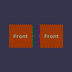
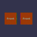
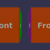
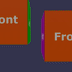

These models are intended to test the use of sparse accessors.  
 
The following table shows the properties that are set for a given model.  

|   | Sample Image | Indices Component Type | Value Component Type | Sparse Accessor | Buffer View | Path |
| :---: | :---: | :---: | :---: | :---: | :---: | :---: |
| [00](SparseAccessors_00.gltf) [View](https://bghgary.github.io/glTF-Assets-Viewer/?type=Positive&folder=25&model=0) |  | Unsigned Int | Float | Input | :white_check_mark: | Translation |
| [01](SparseAccessors_01.gltf) [View](https://bghgary.github.io/glTF-Assets-Viewer/?type=Positive&folder=25&model=1) |  | Unsigned Byte | Float | Input | :white_check_mark: | Translation |
| [02](SparseAccessors_02.gltf) [View](https://bghgary.github.io/glTF-Assets-Viewer/?type=Positive&folder=25&model=2) |  | Unsigned Short | Float | Input | :white_check_mark: | Translation |
| [03](SparseAccessors_03.gltf) [View](https://bghgary.github.io/glTF-Assets-Viewer/?type=Positive&folder=25&model=3) |  | Unsigned Int | Float | Output | :white_check_mark: | Translation |
| [04](SparseAccessors_04.gltf) [View](https://bghgary.github.io/glTF-Assets-Viewer/?type=Positive&folder=25&model=4) |  | Unsigned Byte | Float | Output | :white_check_mark: | Translation |
| [05](SparseAccessors_05.gltf) [View](https://bghgary.github.io/glTF-Assets-Viewer/?type=Positive&folder=25&model=5) |  | Unsigned Short | Float | Output | :white_check_mark: | Translation |
| [06](SparseAccessors_06.gltf) [View](https://bghgary.github.io/glTF-Assets-Viewer/?type=Positive&folder=25&model=6) |  | Unsigned Int | Float | Output | :white_check_mark: | Rotation |
| [07](SparseAccessors_07.gltf) [View](https://bghgary.github.io/glTF-Assets-Viewer/?type=Positive&folder=25&model=7) |  | Unsigned Int | Normalized Byte | Output | :white_check_mark: | Rotation |
| [08](SparseAccessors_08.gltf) [View](https://bghgary.github.io/glTF-Assets-Viewer/?type=Positive&folder=25&model=8) |  | Unsigned Int | Normalized Short | Output | :white_check_mark: | Rotation |
| [09](SparseAccessors_09.gltf) [View](https://bghgary.github.io/glTF-Assets-Viewer/?type=Positive&folder=25&model=9) |  | Unsigned Int | Float | Output | :x: | Translation |
 
