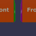

These models are intended to test the use of sparse accessors.  

The following table shows the properties that are set for every model.  

| Property | **Values** |
| :---: | :---: |

 
The following table shows the properties that are set for a given model.  

|   | Sample Image | Sparse Accessor | Description |
| :---: | :---: | :---: | :---: |
| [00](SparseAccessors_00.gltf) [View](https://bghgary.github.io/glTF-Assets-Viewer/?type=Positive&folder=25&model=0) |  | Animation Sampler Input | Has a bufferView. |
 
