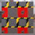

These models are intended to test the various sampler properties that can be set with a texture.  

The following table shows the properties that are set for every model.  

| Property | **Values** |
| :---: | :---: |
| Base Color Texture |  |

 
The following table shows the properties that are set for a given model.  

|   | Sample Image | Wrap T | Wrap S | Mag Filter | Min Filter |
| :---: | :---: | :---: | :---: | :---: | :---: |
| [00](Texture_Sampler_00.gltf) [View](https://bghgary.github.io/glTF-Assets-Viewer/?type=Positive&folder=21&model=0) |  |   |   |   |   |
| [01](Texture_Sampler_01.gltf) [View](https://bghgary.github.io/glTF-Assets-Viewer/?type=Positive&folder=21&model=1) |  | Clamp To Edge |   |   |   |
| [02](Texture_Sampler_02.gltf) [View](https://bghgary.github.io/glTF-Assets-Viewer/?type=Positive&folder=21&model=2) |  | Mirrored Repeat |   |   |   |
| [03](Texture_Sampler_03.gltf) [View](https://bghgary.github.io/glTF-Assets-Viewer/?type=Positive&folder=21&model=3) |  |   | Clamp To Edge |   |   |
| [04](Texture_Sampler_04.gltf) [View](https://bghgary.github.io/glTF-Assets-Viewer/?type=Positive&folder=21&model=4) |  |   | Mirrored Repeat |   |   |
| [05](Texture_Sampler_05.gltf) [View](https://bghgary.github.io/glTF-Assets-Viewer/?type=Positive&folder=21&model=5) |  |   |   | Nearest |   |
| [06](Texture_Sampler_06.gltf) [View](https://bghgary.github.io/glTF-Assets-Viewer/?type=Positive&folder=21&model=6) |  |   |   | Linear |   |
| [07](Texture_Sampler_07.gltf) [View](https://bghgary.github.io/glTF-Assets-Viewer/?type=Positive&folder=21&model=7) |  |   |   |   | Nearest |
| [08](Texture_Sampler_08.gltf) [View](https://bghgary.github.io/glTF-Assets-Viewer/?type=Positive&folder=21&model=8) |  |   |   |   | Linear |
| [09](Texture_Sampler_09.gltf) [View](https://bghgary.github.io/glTF-Assets-Viewer/?type=Positive&folder=21&model=9) |  |   |   |   | Nearest Mipmap Nearest |
| [10](Texture_Sampler_10.gltf) [View](https://bghgary.github.io/glTF-Assets-Viewer/?type=Positive&folder=21&model=10) |  |   |   |   | Linear Mipmap Nearest |
| [11](Texture_Sampler_11.gltf) [View](https://bghgary.github.io/glTF-Assets-Viewer/?type=Positive&folder=21&model=11) |  |   |   |   | Nearest Mipmap Linear |
| [12](Texture_Sampler_12.gltf) [View](https://bghgary.github.io/glTF-Assets-Viewer/?type=Positive&folder=21&model=12) |  |   |   |   | Linear Mipmap Linear |
| [13](Texture_Sampler_13.gltf) [View](https://bghgary.github.io/glTF-Assets-Viewer/?type=Positive&folder=21&model=13) |  | Clamp To Edge | Clamp To Edge | Nearest | Nearest |
 
