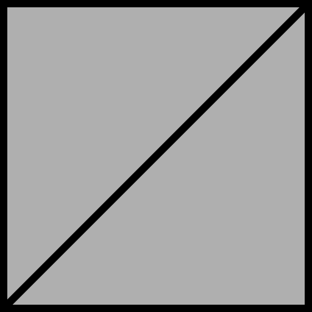

No attributes are explicitly set in every model generated by this test, other than those in the base model.  

If both Vertex UV 0 and 1 are set on a model, then all of the textures will use Vertex UV 1.

All values of Byte and Short are normalized unsigned.

 Vertex UV 0 |  Vertex UV 1
:---: | :---:
 | 

The following table shows the properties that are set for a given model.  

Index | Vertex Normal | Vertex Tangent | Vertex UV 0 | Vertex UV 1 | Vertex Color | Normal Texture | Base Color Texture
:---: | :---: | :---: | :---: | :---: | :---: | :---: | :---:
[00](./Primitive_Attribute_00.gltf) |   |   |   |   |   |   |  
[01](./Primitive_Attribute_01.gltf) | :white_check_mark: | :white_check_mark: | Float | Float | Vector4 Float |  | 
[02](./Primitive_Attribute_02.gltf) | :white_check_mark: |   | Float |   |   |   | 
[03](./Primitive_Attribute_03.gltf) | :white_check_mark: |   | Float |   |   |  | 
[04](./Primitive_Attribute_04.gltf) | :white_check_mark: | :white_check_mark: | Float |   |   |  | 
[05](./Primitive_Attribute_05.gltf) |   |   | Float |   |   |   | 
[06](./Primitive_Attribute_06.gltf) |   |   | Float | Float |   |   | 
[07](./Primitive_Attribute_07.gltf) |   |   | Float |   |   |  | 
[08](./Primitive_Attribute_08.gltf) |   |   | Byte |   |   |   | 
[09](./Primitive_Attribute_09.gltf) |   |   | Byte | Byte |   |   | 
[10](./Primitive_Attribute_10.gltf) |   |   | Short |   |   |   | 
[11](./Primitive_Attribute_11.gltf) |   |   | Short | Short |   |   | 
[12](./Primitive_Attribute_12.gltf) |   |   | Float |   | Vector4 Float |   |  
[13](./Primitive_Attribute_13.gltf) |   |   | Float |   | Vector4 Byte |   |  
[14](./Primitive_Attribute_14.gltf) |   |   | Float |   | Vector4 Short |   |  
[15](./Primitive_Attribute_15.gltf) |   |   | Float |   | Vector3 Float |   |  
[16](./Primitive_Attribute_16.gltf) |   |   | Float |   | Vector3 Byte |   |  
[17](./Primitive_Attribute_17.gltf) |   |   | Float |   | Vector3 Short |   |  
 
