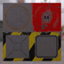
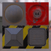

These models are intended to test the attributes that can be applied to a primitive.  

The following table shows the properties that are set for every model.  

| Property | **Values** |
| :---: | :---: |
| Base Color Texture |  |

 

All values of Byte and Short are normalized unsigned.  

The following table shows the properties that are set for a given model.  

|   | Sample Image | Vertex UV 0 | Vertex Normal | Vertex Tangent | Normal Texture |
| :---: | :---: | :---: | :---: | :---: | :---: |
| [00](Primitive_Attribute_00.gltf) [View](https://bghgary.github.io/glTF-Assets-Viewer/?folder=14&model=0) |  | Float |   |   |   |
| [01](Primitive_Attribute_01.gltf) [View](https://bghgary.github.io/glTF-Assets-Viewer/?folder=14&model=1) |  | Byte |   |   |   |
| [02](Primitive_Attribute_02.gltf) [View](https://bghgary.github.io/glTF-Assets-Viewer/?folder=14&model=2) |  | Short |   |   |   |
| [03](Primitive_Attribute_03.gltf) [View](https://bghgary.github.io/glTF-Assets-Viewer/?folder=14&model=3) |  | Float | :white_check_mark: |   |   |
| [04](Primitive_Attribute_04.gltf) [View](https://bghgary.github.io/glTF-Assets-Viewer/?folder=14&model=4) |  | Float |   |   |  |
| [05](Primitive_Attribute_05.gltf) [View](https://bghgary.github.io/glTF-Assets-Viewer/?folder=14&model=5) |  | Float | :white_check_mark: |   |  |
| [06](Primitive_Attribute_06.gltf) [View](https://bghgary.github.io/glTF-Assets-Viewer/?folder=14&model=6) |  | Float | :white_check_mark: | :white_check_mark: |  |
 
