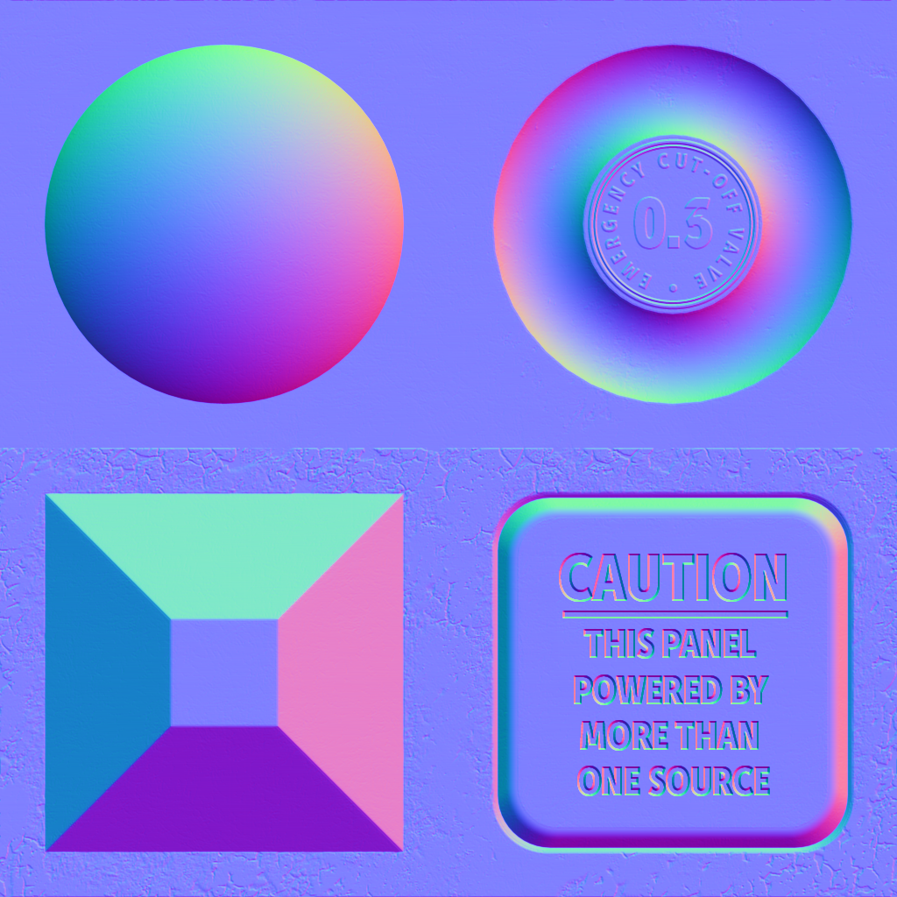

These models are intended to test the attributes that can be applied to a primitive.  

All values of Byte and Short are normalized unsigned.  

The following table shows the properties that are set for a given model.  

Index | Vertex UV 0 | Vertex Normal | Vertex Tangent | Normal Texture | Base Color Texture
:---: | :---: | :---: | :---: | :---: | :---:
[00](Primitive_Attribute_00.gltf) |   |   |   |   |  
[01](Primitive_Attribute_01.gltf) | Float |   |   |   | 
[02](Primitive_Attribute_02.gltf) | Byte |   |   |   | 
[03](Primitive_Attribute_03.gltf) | Short |   |   |   | 
[04](Primitive_Attribute_04.gltf) | Float | :white_check_mark: |   |   | 
[05](Primitive_Attribute_05.gltf) | Float |   |   |  | 
[06](Primitive_Attribute_06.gltf) | Float | :white_check_mark: |   |  | 
[07](Primitive_Attribute_07.gltf) | Float | :white_check_mark: | :white_check_mark: |  | 
 
