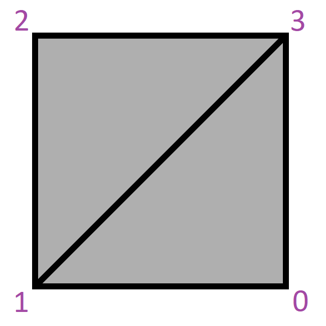

No attributes are explicitly set in every model generated by this test, other than those in the base model.  

All values of Byte, SHort, and Int are unsigned

 

All model's indices values relate to vertexes as shown by the following image.  

Indices | 
:---: | 
 |

 

The following table shows the properties that are set for a given model.  

~~Table~~ 
