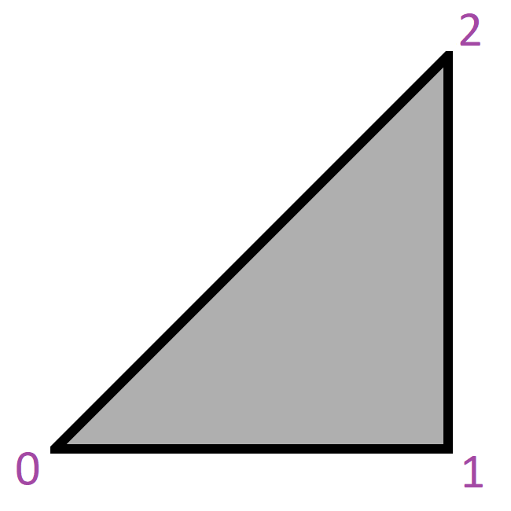
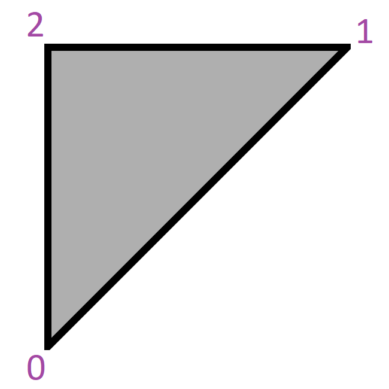
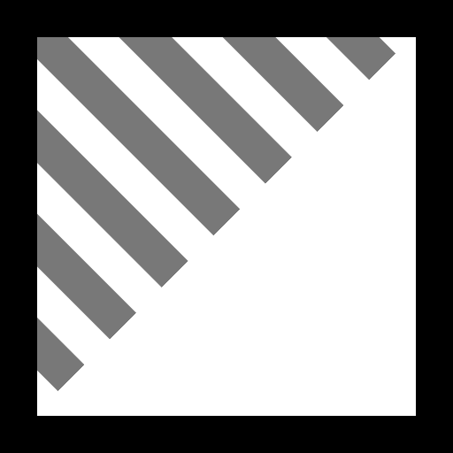
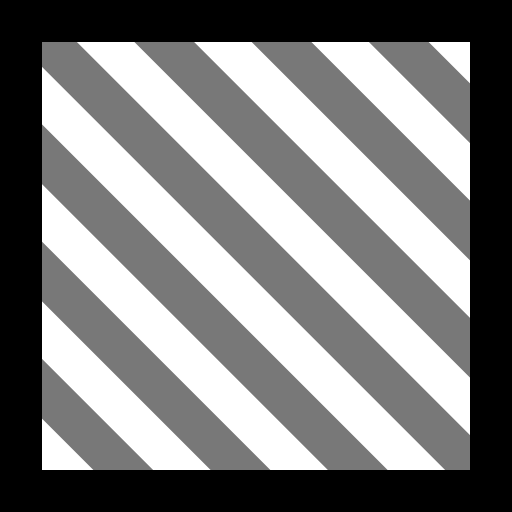

No attributes are explicitly set in every model generated by this test, other than those in the base model.  

 

Both primitives are using the same indices values, but have different vertex positions.  

Indices for Primitive 1 (Left) | Indices for Primitive 2 (Right)
:---: | :---:
 | 

  

If Vertex UV 1 is set, then it is the UV used by the texture. Otherwise Vertex UV 0 is used. Both primitives have different UV values.  

Vertex UV 0 Mapping | Vertex UV 1 Mapping
:---: | :---:
 | 

  

The following table shows the properties that are set for a given model.  

~~Table~~ 
