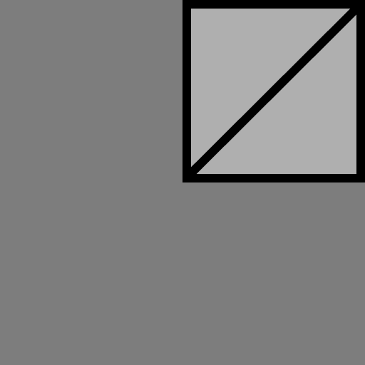

No attributes are explicitly set in every model generated by this test, other than those in the base model.  

If both Vertex UV 1 and 2 are set on a model, then only values for Vertex UV 2 are used by the textures.  
Vertex UV 1 maps the entire texture to the model, while Vertex UV 2 only maps the top corner to the model.
Vertex UV 1 | Vertex UV 2
:---: | :---:
 | 

The following table shows the properties that are set for a given model.  

~~Table~~ 
