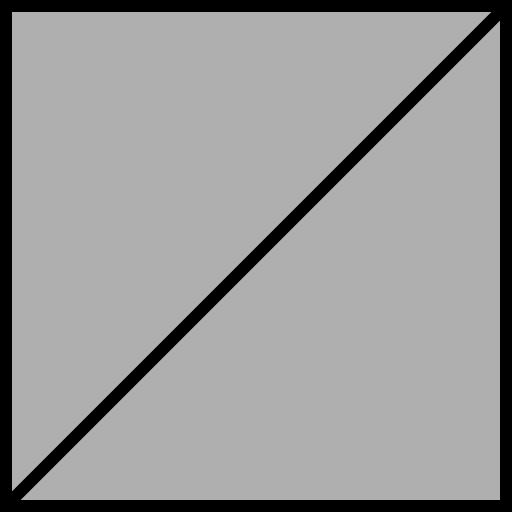

No attributes are explicitly set in every model generated by this test, other than those in the base model.  

If both Vertex UV 1 and 2 are set on a model, then all of the textures will use Vertex UV 2.
Vertex UV 1 | Vertex UV 2
:---: | :---:
 | 

The following table shows the properties that are set for a given model.  

~~Table~~ 
